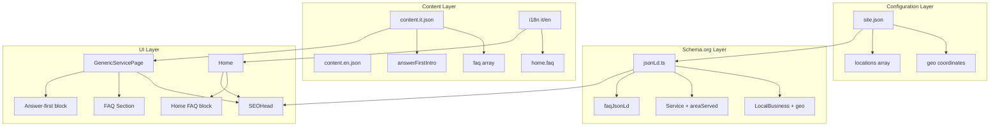

# План повышения GEO/SEO для Genius Lab

## Цели

- Улучшить ранжирование по запросам «dove riparare macbook roma», «riparazione MacBook Roma»
- Повысить видимость в AI-поиске (ChatGPT, Google AI Overviews)
- Сделать разметку расширяемой для будущих локаций и страниц

---

## Архитектура изменений

---

## Этап 1: Расширение site.json — geo-координаты

**Файл:** `web/src/config/site.json`

- Добавить в каждый объект `locations` опциональное поле `geo` с координатами Viale Somalia 246, Roma
- Координаты: latitude 41.9234, longitude 12.5132 (Viale Somalia 246)
- Поле `geo` — опциональное

---

## Этап 2: Обновление jsonLd.ts

**Файл:** `web/src/app/utils/jsonLd.ts`

- **LocalBusiness:** geo (если loc.geo), image (base + "/logo.png")
- **Service:** areaServed из siteConfig.locations[0].city, serviceType (опционально)
- **faqJsonLd():** новая функция для FAQPage schema
- Типы для Location с geo в config

---

## Этап 3: Расширение схемы контента

**Файлы:** `web/server/api/content.ts`, `web/src/app/context/ContentContext.tsx`

- servicePageSchema: faq, answerFirstIntro, keywords (опционально)
- ServicePageData типы

---

## Этап 4: Контент (топ-4)

**Файлы:** `web/server/data/content.it.json`, `content.en.json`

- macbook, iphone, ipad, dataRecovery: answerFirstIntro, faq, keywords

---

## Этап 5: GenericServicePage

**Файл:** `web/src/app/components/GenericServicePage.tsx`

- Answer-first блок, FAQ-секция
- SEOHead: faqJsonLd, page-specific keywords

---

## Этап 6: Admin ServicePageEdit

**Файл:** `web/src/app/admin/pages/ServicePageEdit.tsx`

- Форма: answerFirstIntro, keywords, FaqEditor

---

## Этап 7: i18n

**Файлы:** `web/src/i18n/it.ts`, `web/src/i18n/en.ts`

- Fallback для answer-first, FAQ
- pages.home.keywords, pages.home.faq

---

## Этап 8: Home page FAQ

**Файлы:** `web/src/app/pages/Home.tsx`, i18n

- home.faq в i18n
- Секция HomeFaq
- faqJsonLd в SEOHead

---

## Этап 9: index.html

- `<meta name="geo.region" content="IT-RM">`

---

## Этап 10: Валидация

- Google Rich Results Test после деплоя

---

## Порядок реализации

| # | Этап | Зависимости |
|---|------|-------------|
| 1 | site.json + geo | — |
| 2 | jsonLd.ts | site.json |
| 3 | content schema + типы | — |
| 4 | content (топ-4) | схема |
| 5 | GenericServicePage | jsonLd, content |
| 6 | Admin ServicePageEdit | content schema |
| 7 | i18n | — |
| 8 | Home page FAQ | jsonLd, i18n |
| 9 | index.html geo.region | — |
| 10 | Валидация | после деплоя |
