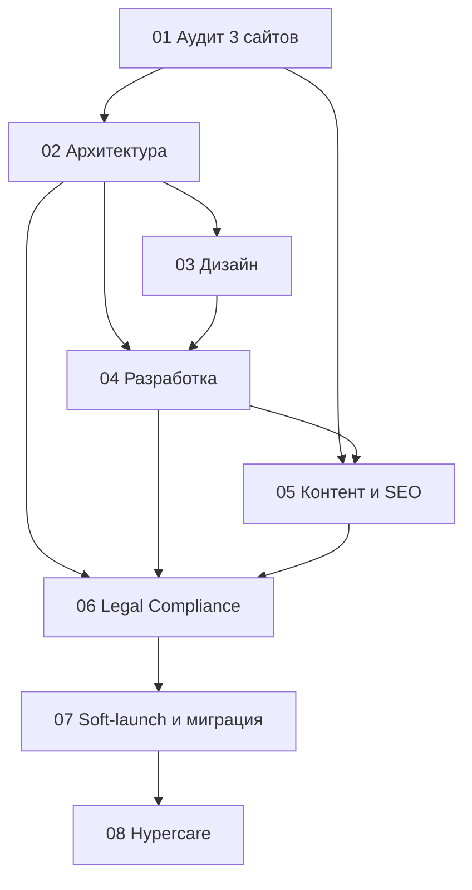

# Финальный план реорганизации и запуска сайта Genius Lab (avatech.info + assistenza-macbook.it + apple-assistenza.it → geniuslab.it)

## Цели реорганизации

- Создать современный сайт компании по ремонту техники Apple под брендом Genius Lab
- Объединить контент и SEO-сигналы трёх текущих сайтов в один канонический домен geniuslab.it
- Обеспечить сильный mobile-first UX и высокую производительность
- Обеспечить соответствие GDPR и юридическую корректность коммуникации
- Стабильно получать лиды через формы (email), телефон и WhatsApp CTA

## Область проекта

### In Scope (релиз v1)

- Единый сайт geniuslab.it вместо `avatech.info`, `assistenza-macbook.it`, `apple-assistenza.it`
- Дизайн в стиле Liquid Glass (в духе Apple UI), mobile-first
- Контент и SEO для ключевых услуг (отдельные страницы услуг)
- Интеграция Google Reviews на странице Recensioni
- Формы с отправкой на email, consent и защитой от спама
- Cookie banner, Privacy Policy, Cookie Policy
- Полная миграция с one-to-one 301-редиректами для 3 старых доменов
- Soft-launch, затем cutover и Hypercare

### Out Of Scope (после v1)

- CRM-интеграция и автоматизация лидов
- Мультиязычный UI (EN/RU) в релизе v1

## Дизайн-направление (v1)

- **Стиль:** Liquid Glass (glass-панели, мягкое размытие фона, полупрозрачные слои, аккуратные световые акценты)
- **Палитра:** базово white/black/gray + прозрачности (`alpha`) для стеклянных слоёв
- **Типографика:** SF Pro как основная гарнитура интерфейса
- **Компоненты:** кнопки и паттерны в духе Apple UI; базовые варианты кнопок берём из библиотеки Xcode как референс
- **Анимация:** плавные микроанимации и появления (opacity/transform), без деградации CWV, с `prefers-reduced-motion`
- **Mobile-first:** целевой опыт сначала для смартфонов, с упрощённым glass-эффектом на слабых устройствах

## Текущее состояние (краткий вывод)

- У организации 3 сайта с пересекающимся и частично конфликтующим контентом
- На сайтах есть дубли и несогласованность расписания/контактов
- Структура URL и навигация различаются; на части страниц перегруженные тексты
- На одном из сайтов присутствуют лишние функциональные артефакты, не соответствующие целевой структуре v1
- Требуется консолидация бренда в единый домен geniuslab.it

## Ключевые решения

| Решение | Выбор |
|---------|-------|
| Канонический домен | geniuslab.it |
| Домены-источники | avatech.info, assistenza-macbook.it, apple-assistenza.it |
| Редиректы | One-to-one 301 со всех 3 доменов на релевантные страницы geniuslab.it |
| Формы | Email-only (без CRM на v1) |
| Стек v1 | Astro (SSG-first, mobile/performance priority) |
| Хостинг | Railway |
| Языки | Релиз только на итальянском |
| I18N-стратегия | Все строки и контент через словари/ключи (готовность к EN/RU позже) |
| Запуск | Soft-launch 7–14 дней, затем Go/No-Go и cutover |
| Окно cutover | Ночное окно по Риму (CET/CEST) |
| Freeze перед cutover | Content/SEO freeze за 48 часов до переключения |
| Оповещения | Email + Telegram |
| Владелец legal-контента | Owner проекта |
| Финальные реквизиты и телефоны | Предоставляются owner перед production cutover |
| Browser support policy | Safari iOS 16+, Chrome Android 110+, desktop Safari/Chrome/Edge/Firefox (последние 2 версии) |
| DRI по release gates | Owner проекта (Go/No-Go, freeze confirmation, cutover start, rollback decision) |

## Принципы

- **Комментарии в коде** — только на английском
- **Планы и описания** — на русском
- **Контент в UI не хардкодить** — использовать словари и ключи
- **Privacy by default** — необязательные cookies/аналитика только после consent
- **SEO migration by design** — сохранять релевантность URL и intent страниц при переносе

## KPI проекта

| Направление | Метрика | Baseline | Target для v1 |
|-------------|---------|----------|---------------|
| Лиды | Отправка форм / визиты | TBD (этап 01) | +20% к baseline через 60 дней |
| Local SEO | Органический трафик по локальным запросам | TBD (этап 01) | +15% через 90 дней |
| CWV | LCP, INP, CLS | TBD (этап 01) | LCP < 2.5s, INP < 200ms, CLS < 0.1 |
| Миграция SEO | Доля old URL с корректным one-to-one 301 | TBD (этап 02) | >= 95% |
| Постмиграция | Доля 404 после cutover | TBD (этап 07) | < 1% от проверенного пула URL |

## Приоритизация (MoSCoW)

- **Must:** консолидация 3 доменов, one-to-one 301, mobile-first, формы/email + consent, legal страницы, ключевые сервисные страницы
- **Should:** мягкие загрузочные анимации, расширенная аналитика CTA, улучшенные trust-блоки
- **Could:** FAQ-расширение, дополнительные лендинги
- **Won't (v1):** CRM, мультиязычный UI

## Риски и допущения

| Риск | Вероятность | Влияние | Mitigation | Trigger | Owner |
|------|-------------|---------|------------|---------|-------|
| Потеря SEO при объединении 3 доменов | Средняя | Высокое | One-to-one mapping, prelaunch crawl, postlaunch мониторинг GSC | Просадка кликов/позиций после cutover | SEO/Owner |
| Несогласованные контакты/расписание | Высокая | Высокое | Единая таблица canonical contacts/hours | Расхождения в UI/schema/GBP | Owner/Content |
| Перегрузка UI-эффектами Liquid Glass | Средняя | Среднее | Performance budget, device testing, graceful degradation | Рост LCP/INP на mobile | Dev/Design |
| Ошибки consent/analytics | Средняя | Высокое | QA сценариев accept/reject/customize, блокировка до consent | Аналитика грузится без согласия | Dev/Owner |
| Низкая доставляемость email-форм | Средняя | Среднее | SPF/DKIM/DMARC, fallback email, тесты | Лиды в spam/потеря заявок | Dev/Owner |
| Юридические риски в формулировках про Apple | Средняя | Среднее | Юридически корректные формулировки и дисклеймеры | Спорные claim'ы/жалобы | Owner |
| DNS/cutover задержки | Средняя | Среднее | Soft-launch, окно cutover, rollback-runbook | Частичная недоступность/ошибки резолва | DevOps/Owner |

## Общий Definition Of Done

Проект завершён, когда:

- Закрыты все `Must`-пункты MoSCoW
- Единый сайт на geniuslab.it работает стабильно на mobile/desktop
- Все 3 старых домена редиректят на релевантные новые URL (one-to-one)
- Критичных legal/consent проблем нет
- Формы доставляют заявки на email и защищены от базового спама
- Подготовлены runbook, rollback, и план post-launch поддержки

## Security и эксплуатационный baseline

- Security headers: CSP, HSTS, X-Frame-Options, Referrer-Policy
- Антиспам форм: honeypot и/или captcha + rate limiting
- Логи ошибок форм и базовый мониторинг критичных сбоев
- Резервный контактный канал (телефон/WhatsApp) при сбое формы

## Политика данных форм (GDPR lifecycle)

- Сбор только минимально необходимых полей
- Ограниченный доступ к данным заявок
- Зафиксированный срок хранения и процедура удаления по запросу
- Явная ссылка на Privacy Policy возле consent чекбокса

## Роли и ответственность

- **Owner проекта:** финальные решения, legal-контент, контакты/расписание; DRI по release gates (Go/No-Go, freeze, cutover, rollback)
- **Разработка:** архитектура, реализация, миграция, техкачество, мониторинг
- **Контент/SEO:** консолидация текстов 3 сайтов, метаданные, schema, postlaunch SEO

---

## Структура документации

```text
docs/
├── PLAN.md                 # Финальный общий план
├── PLAN_CORRECTIONS.md     # История корректировок
├── DESIGN_SPEC.md          # Дизайн-спецификация Liquid Glass (tokens, components, motion)
└── stages/
    ├── 01-audit.md
    ├── 02-architecture.md
    ├── 03-design.md
    ├── 04-development.md
    ├── 05-content-seo.md
    ├── 06-legal-compliance.md
    ├── 07-launch.md
    └── 08-hypercare.md
```

---

## Зависимости этапов



---

## Сводная таблица этапов

| Этап | Входные данные | Результаты |
|------|----------------|------------|
| 01 Аудит | 3 текущих сайта | Аудит, baseline KPI, инвентаризация доменов и контента |
| 02 Архитектура | Отчёт аудита | IA, URL-стандарты, i18n-стратегия, карта one-to-one редиректов |
| 03 Дизайн | Архитектура, требования | Liquid Glass design system и mobile-first макеты |
| 04 Разработка | Архитектура, дизайн | Production-ready frontend, формы/email, glass-эффекты и анимации без деградации CWV |
| 05 Контент и SEO | Аудит, разработка | Консолидированный контент, schema, SEO-миграционный пакет |
| 06 Legal Compliance | Архитектура, разработка, контент | Consent, Privacy/Cookie, юридически корректные формулировки |
| 07 Soft-launch и миграция | Legal, SEO-пакет, QA | Go/No-Go, cutover, 301 на 3 доменах, rollback-runbook |
| 08 Hypercare | Запуск | Стабилизация, мониторинг, backlog v1.1 |

---

## Стратегия запуска

1. **Soft-launch (7–14 дней):** проверка в боевых условиях на preview/test домене
2. **Go/No-Go:** формальное решение по чеклисту QA/SEO/Legal/Forms
3. **Freeze (48h):** заморозка контентных и SEO-изменений перед переключением
4. **Cutover:** DNS + 301-редиректы для 3 доменов
5. **Hypercare (14–30 дней):** мониторинг 404/500, CWV, лидов, индексации

### Критерии отката (Rollback)

- Критичные сценарии недоступны > 30 минут
- Формы не доставляют заявки и нет оперативного workaround
- Массовые ошибки редиректов/каноникализации после cutover

---

## Навигация по этапам

- [Дизайн-спецификация (Liquid Glass)](DESIGN_SPEC.md)
- [Этап 1: Аудит](stages/01-audit.md)
- [Этап 2: Архитектура](stages/02-architecture.md)
- [Этап 3: Дизайн](stages/03-design.md)
- [Этап 4: Разработка](stages/04-development.md)
- [Этап 5: Контент и SEO](stages/05-content-seo.md)
- [Этап 6: Legal Compliance](stages/06-legal-compliance.md)
- [Этап 7: Soft-launch и миграция](stages/07-launch.md)
- [Этап 8: Hypercare](stages/08-hypercare.md)
