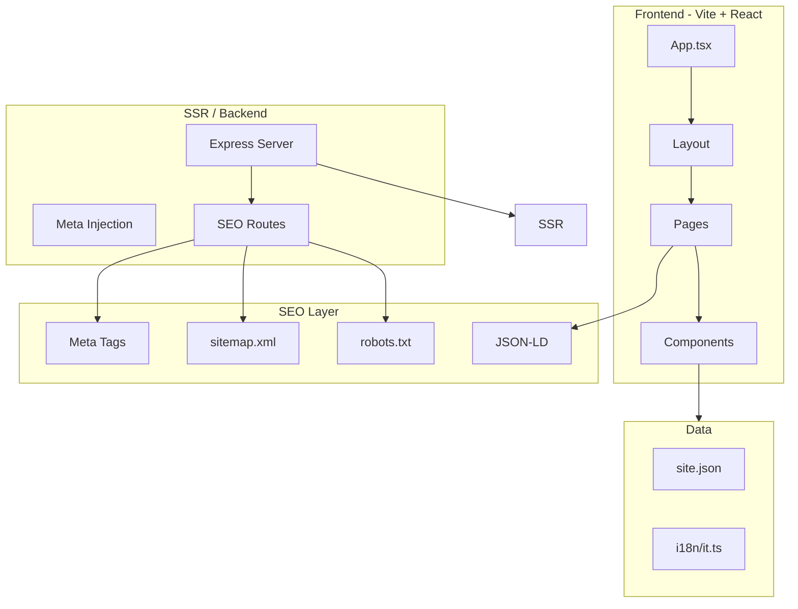

# План: Сайт Genius Lab на Figma + Vite с SEO-оптимизацией

> Документ для опоры при реализации. Все комментарии в коде — на английском; планы и описания — на русском.

## Цели

- Взять дизайн [Apple Service Center Website](../Apple%20Service%20Center%20Website/) в качестве основы
- Стек: Vite + React (как в Figma Make)
- Backend для SEO: SSR, robots.txt, sitemap.xml, meta tags, JSON-LD
- Обеспечить высокие позиции в поиске (Google, Bing)
- Комментарии в коде — только на английском; планы и описания — на русском

---

## Архитектура (перспектива)



---

## Этап 1: Инициализация проекта

**Задачи:**

1. Заменить содержимое `web/` новым проектом на базе [Apple Service Center Website](../Apple%20Service%20Center%20Website/) — копировать структуру, `vite.config.ts`, `package.json`. Перед заменой — создать бэкап текущего web/
2. Удалить лишние зависимости (MUI, Radix, recharts и т.п.), оставить: React, React Router, Tailwind, Lucide, Motion (или заменить на CSS-анимации)
3. Перенести конфигурацию из текущего web (до замены): `site.json` — brand, contacts, locations, hours
4. Перенести i18n из `web/src/i18n/it.ts` — структура для итальянского контента
5. Структура папок:

```
web/
├── src/
│   ├── app/           # React Router, Root, routes
│   ├── components/    # UI, Layout, shared
│   ├── config/       # site.json
│   ├── i18n/         # it.ts
│   ├── pages/        # Page components
│   └── server/       # SSR entry, SEO helpers
├── public/
├── index.html
├── vite.config.ts
└── server/            # Express SSR server
```

**Результат:** Рабочий Vite + React проект с конфигом и i18n.

---

## Этап 2: SSR и Backend для SEO

**Проблема:** SPA (Vite + React) плохо индексируется — без SSR crawlers получают пустой HTML.

**Решение:** Vite SSR + Express.

**Задачи:**

1. Настроить Vite SSR: `vite.config.ts` — `build: { ssr: true }`, `server: { middlewareMode: true }` или отдельный entry
2. Создать `server/index.js` (Express):
   - Обработка `/robots.txt` — динамический ответ с `Sitemap: ${base}/sitemap.xml`
   - Обработка `/sitemap.xml` — генерация XML из списка маршрутов
   - Обработка всех остальных — отдача SSR-рендера React
3. SEO-модуль `src/server/seo.ts`:
   - `getRoutes()` — список URL для sitemap (/, /servizi, /servizi/*, /contatti, /chi-siamo, /recensioni, /privacy-policy, /cookie-policy)
   - `robotsTxt(baseUrl)` — тело robots.txt
   - `sitemapXml(baseUrl, routes)` — тело sitemap.xml; опционально `lastmod` для актуальности
4. Переменная окружения `PUBLIC_SITE_URL` для base URL (canonical, sitemap, robots)

**Интеграция:** `server/index.js` импортирует `seo.ts` и отдаёт ответы на `/robots.txt`, `/sitemap.xml`.

**Перспектива:** SEO-модуль будет использоваться при добавлении новых страниц — маршруты расширяются в одном месте.

---

## Этап 3: Meta-теги и JSON-LD

**Задачи:**

1. Создать компонент `SEOHead` или `DocumentHead`:
   - Пропсы: `title`, `description`, `jsonLd`, `canonical`, `noindex`
   - Рендер: `<title>`, `<meta name="description">`, `<meta property="og:*">`, `<link rel="canonical">`, `<script type="application/ld+json">`
2. В SSR: вставлять `SEOHead` в `<head>` до гидрации
3. Схемы JSON-LD:
   - Главная: `Organization` или `LocalBusiness`
   - Contatti: `LocalBusiness` (телефон, email, адрес)
   - Страницы услуг: `Service` с `provider: LocalBusiness`
4. Каждая страница передаёт `meta` и `jsonLd` в layout

**Перспектива:** `SEOHead` — единая точка для всех страниц; при добавлении Open Graph images, Twitter Cards — расширяем только этот компонент.

---

## Этап 4: Адаптация Figma-компонентов

**Источник:** [Apple Service Center Website/src/app/components/](../Apple%20Service%20Center%20Website/src/app/components/)

**Задачи:**

1. **Navigation** — заменить placeholder на `site.json` и `i18n`:
   - Логотип: Genius Lab
   - Ссылки: Servizi (dropdown), Chi Siamo, Recensioni, Contatti
   - CTA: `tel:${site.contacts.phonePrimary}`
   - Маршруты: привести к структуре Astro (9 услуг вместо 5)
2. **Hero** — подставить `it.brand.name`, `it.brand.tagline`, телефоны из `site.json`
3. **Services** — маппинг 9 услуг Genius Lab (MacBook, iMac, Display, Data Recovery, Battery, SSD, Flexgate, Tastiera, Software) на маршруты
4. **Process** — оставить 3 шага (Diagnostica, Riparazione, Controllo Qualità)
5. **Contact** — подставить `site.locations`, `site.contacts`, `site.hours`; форма — Formspree или аналог
6. **Footer** — ссылки Privacy, Cookie; часы из `site.hours`
7. **MapEmbed** — Google Maps iframe (адрес из site.locations), fallback-текст при ошибке загрузки
8. **ReviewsEmbed** — Google Reviews iframe, fallback-текст; `data-embed-wrapper` для SiteScripts

**Перспектива:** Компоненты получают данные через пропсы или контекст; при добавлении мультиязычности (en) — `i18n` расширяется, компоненты не меняются.

---

## Этап 5: Маршруты и страницы

**Задачи:**

1. Расширить routes:
   - `/` — Home
   - `/servizi` — каталог услуг
   - `/servizi/riparazione-macbook`, `/servizi/riparazione-imac`, `/servizi/display-macbook`, `/servizi/data-recovery`, `/servizi/batteria-macbook`, `/servizi/macbook-ssd`, `/servizi/flexgate-display-macbook`, `/servizi/tastiera-macbook`, `/servizi/software-assistenza`
   - `/contatti`
   - `/chi-siamo`
   - `/recensioni`
   - `/privacy-policy`
   - `/cookie-policy`
   - `/404`
2. Страницы услуг — использовать шаблон `ServiceDetail` (MacBookService как пример) с пропсами: `title`, `subtitle`, `icon`, `diagnostics`, `actions`, `problems`
3. Контент страниц — из i18n и site.json
4. **Recensioni** — секции: eyebrow + heading, checkpoints (Indicatori osservati), widget fallback, ReviewsEmbed (Google Reviews iframe)
5. **Chi-siamo** — values (Trasparenza, Affidabilita, Approccio), timeline (Presa in carico, Allineamento, Chiusura)
6. **Contatti** — блоки контактов (Indirizzo, Telefono, Email, Orari), supportCases, ContactForm, MapEmbed (Google Maps iframe)
7. **404** — страница с noindex, CTA «Torna alla home»; стили в духе Figma
8. **ScrollToTop** — кнопка «вверх» при скролле (как в Figma)

**Перспектива:** `routes.tsx` + `getRoutes()` в SEO-модуле синхронизированы; при добавлении страницы — обновить оба места.

---

## Этап 6: Формы и consent

**Задачи:**

1. ContactForm — `action` Formspree, поля: name, phone_or_email, message, consent; `data-form` для аналитики
2. ConsentBanner — cookie consent, кнопки Accetta/Rifiuta; `data-consent-action`; сохранение в localStorage
3. SiteScripts — загрузка GTM по консенсусу; обработка `data-track`, `data-form` для событий

**Перспектива:** При смене аналитики (GTM → Plausible) — меняется только SiteScripts; формы и consent не трогаем.

---

## Этап 7: Стили и анимации

**Задачи:**

1. Tailwind — минималистичная палитра (белый/чёрный/серый) как в Figma
2. Motion → заменить на CSS `@keyframes` или `transition`; `prefers-reduced-motion: reduce` — отключить анимации
3. Системные шрифты: `-apple-system, BlinkMacSystemFont, 'SF Pro Text', 'Inter', sans-serif`
4. Responsive: mobile-first, breakpoints 640/768/1024

**Перспектива:** Design tokens в `tailwind.config` — при смене темы расширяем только конфиг.

---

## Этап 8: Дополнительные SEO-меры

**Задачи:**

1. **Canonical URL** — на каждой странице `<link rel="canonical" href={canonical}>`
2. **html lang="it"** — в `<html>` для итальянского контента
3. **hreflang** — если позже добавим en — `hreflang="it"` / `hreflang="en"`
4. **Semantic HTML** — `<main>`, `<nav>`, `<header>`, `<footer>`, `<article>`
5. **Accessibility** — `aria-label`, `:focus-visible`, skip link
6. **Core Web Vitals** — lazy loading, оптимизация изображений
7. **Structured data** — BreadcrumbList для страниц услуг (опционально)
8. **Favicon** — подключить favicon.svg или favicon.ico в корне
9. **Open Graph image** — og:image добавить позже по запросу

**Перспектива:** SEO-чеклист перед релизом — проверка meta, robots, sitemap, Lighthouse.

---

## Этап 9: Сборка и деплой

**Задачи:**

1. `npm run build` — Vite build (client + server bundle)
2. `npm run dev` — Vite dev (SPA без SSR); `npm run start` — Express с SSR (production)
3. Dockerfile — multi-stage: build → serve (Node или nginx)
4. Railway — деплой через `railway up` или Docker
5. Переменные: `PUBLIC_SITE_URL`, `PUBLIC_FORM_ENDPOINT`, `PUBLIC_GTM_ID` (опционально)
6. **Health check** — `/healthz` возвращает `200` и `ok` для мониторинга Railway
7. **Security headers** — X-Frame-Options, X-Content-Type-Options, Referrer-Policy, CSP (разрешить formspree.io, googletagmanager.com, maps.google.com)

---

## Этап 10: Тестирование

**Задачи:**

1. Проверка всех маршрутов
2. `curl` / robots.txt, sitemap.xml
3. Google Search Console — проверка индексации
4. Lighthouse — Performance, Accessibility, SEO
5. Мобильная вёрстка
6. Формы: отправка, consent, валидация

---

## Файлы для создания/изменения

**Новые (в web/):**

- Структура проекта (замена Astro на Vite + React)
- `server/index.js` — Express SSR
- `src/server/seo.ts` — robots, sitemap
- `src/components/SEOHead.tsx`
- `src/config/site.json`
- `src/i18n/it.ts`

**Из Figma Make (адаптация):**

- `src/app/components/Navigation.tsx`
- `src/app/components/Hero.tsx`
- `src/app/components/Services.tsx`
- `src/app/components/Process.tsx`
- `src/app/components/Contact.tsx`
- `src/app/components/Footer.tsx`
- `src/app/components/ScrollToTop.tsx`
- `src/app/components/MapEmbed.tsx`
- `src/app/components/ReviewsEmbed.tsx`
- `src/app/pages/Home.tsx`
- `src/app/pages/ServiceDetail.tsx` (или MacBookService как шаблон)

---

## Риски и митигация

| Риск | Митигация |
|------|-----------|
| SSR сложность | Использовать Vite SSR docs; при необходимости — prerender на build |
| Дублирование контента | Строгий canonical; noindex для /404 |
| Регрессия SEO при смене | Документировать SEO-чеклист; тесты на robots/sitemap |
| Hydration mismatch | Убедиться, что client и server рендерят одинаково; избегать `window` в initial render |

---

## Связь с существующим проектом

- **web/** — полностью заменяется на Vite + React; перед заменой создаётся бэкап
- Контент (site.json, i18n) — переносится из текущего web; контент страниц recensioni, chi-siamo, contatti — из текущего Astro

---

## Порядок выполнения

1. Этап 1 — инициализация
2. Этап 2 — SSR и SEO backend
3. Этап 3 — meta и JSON-LD
4. Этап 4 — адаптация компонентов
5. Этап 5 — маршруты и страницы
6. Этап 6 — формы и consent
7. Этап 7 — стили
8. Этап 8 — доп. SEO
9. Этап 9 — сборка и деплой
10. Этап 10 — тестирование
