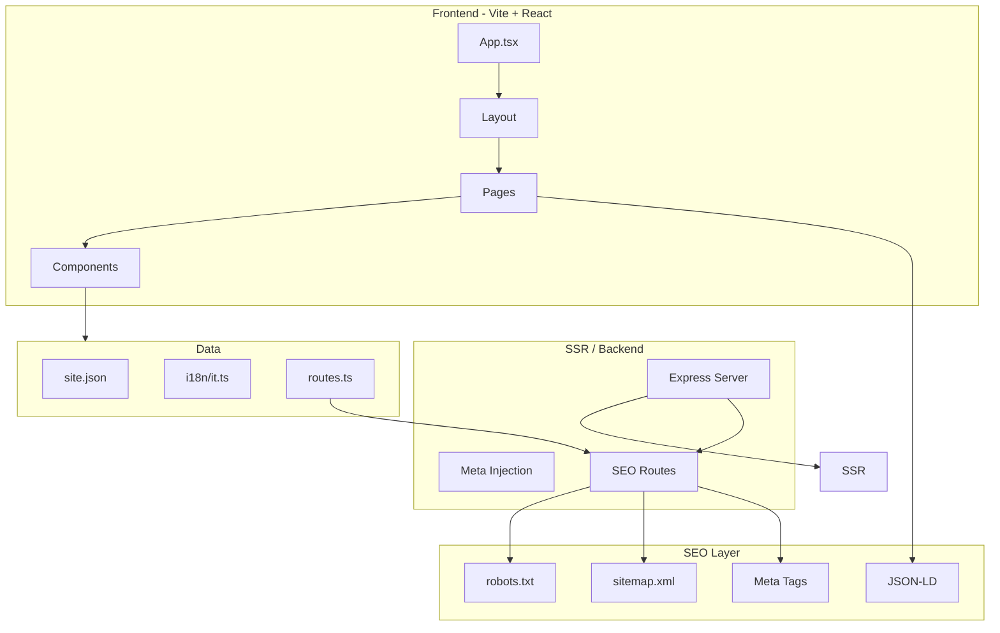

# Объединённый план: Figma + Vite + SEO (Genius Lab)

> Рабочий документ для реализации. Комментарии в коде — на английском; планы и описания — на русском.

## 1. Цели и принципы

**Цели:**
- Перенести сайт на Vite + React на базе дизайна [Apple Service Center Website](../Apple%20Service%20Center%20Website/)
- Обеспечить индексируемый SSR-рендер
- Сохранить и усилить SEO при миграции (redirect map, canonical)
- Сохранить контент из текущего `web/` (site.json, i18n, страницы)

**Принципы:**
- **Single source of truth для роутов:** один модуль `routes.ts` для React Router + sitemap + internal links
- **Каноникализация URL на уровне сервера:** http→https, www policy, trailing slash
- **Fail-safe SSR:** при сбое — контролируемый HTML fallback, не пустой контейнер
- **SEO-проверки в CI:** robots, sitemap, canonical, noindex

---

## 2. Архитектура



---

## 3. Этапы с Definition of Done

### Этап 1. Инициализация и перенос структуры

**Задачи:**
- Подготовить backup текущего `web/`
- Заменить `web/` на Vite + React основу из Apple Service Center Website
- Перенести `site.json`, `i18n/it.ts`, базовые ассеты
- Очистить лишние зависимости (MUI, Radix, recharts); оставить React, React Router, Tailwind, Lucide

**Структура:**
```
web/
├── server/
│   └── index.ts
├── src/
│   ├── app/
│   │   ├── routes.ts      # source of truth
│   │   └── router.tsx
│   ├── components/
│   ├── config/site.json
│   ├── i18n/it.ts
│   ├── pages/
│   └── server/
│       ├── seo.ts
│       └── redirects.ts
└── public/
```

**DoD:** `npm install` и `npm run dev` работают; site.json и i18n подключены.

---

### Этап 2. SSR и backend-ядро

**Задачи:**
- Express SSR (`server/index.ts`)
- `/robots.txt`, `/sitemap.xml`, `/healthz`
- `routes.ts` как источник маршрутов
- `redirects.ts` — таблица 301
- `PUBLIC_SITE_URL` и валидация env

**DoD:** curl /healthz => 200 ok; robots.txt и sitemap.xml корректны; SSR отдаёт HTML.

---

### Этап 3. Head/Meta/Schema

**Задачи:**
- `SEOHead` (title, description, canonical, og, noindex, jsonLd)
- JSON-LD: Home (LocalBusiness), Contatti, Services (Service + provider)

**DoD:** Уникальные title/description/canonical на страницах; /404 с noindex; JSON-LD валиден.

---

### Этап 4. Адаптация компонентов из Figma

**Задачи:**
- Navigation, Hero, Services, Process, Contact, Footer, ScrollToTop, MapEmbed, ReviewsEmbed
- Данные из site.json/i18n; 9 услуг Genius Lab

**DoD:** Блоки соответствуют макету; нет layout breakage на mobile/desktop.

---

### Этап 5. Маршруты и страницы

**Маршруты:** /, /servizi, /servizi/* (9 услуг), /contatti, /chi-siamo, /recensioni, /privacy-policy, /cookie-policy, /404

**Контент страниц:**
- **Recensioni:** checkpoints (Indicatori osservati), ReviewsEmbed, fallback
- **Chi-siamo:** values (Trasparenza, Affidabilita, Approccio), timeline (Presa in carico, Allineamento, Chiusura)
- **Contatti:** блоки Indirizzo/Telefono/Email/Orari, supportCases, ContactForm, MapEmbed
- **404:** noindex, CTA «Torna alla home»

**DoD:** Все маршруты открываются; ссылки в nav/footer корректны.

---

### Этап 6. Формы, consent и аналитика

**Задачи:** ContactForm (Formspree), ConsentBanner, SiteScripts (GTM по consent), data-track/data-form

**DoD:** Форма отправляется; аналитика до consent не активна.

---

### Этап 7. Стили, анимации, accessibility

**Задачи:** Tailwind tokens (белый/чёрный/серый), prefers-reduced-motion, semantic HTML, skip link, focus-visible

**DoD:** Нет accessibility-блокеров; анимации отключаются при reduced motion.

---

### Этап 8. SEO hardening

**Задачи:** Canonical везде, html lang="it", favicon, BreadcrumbList (опционально)

**DoD:** Canonical совпадает с URL; служебные страницы исключены.

---

### Этап 9. Сборка, деплой, безопасность

**Задачи:** Build client+server, Dockerfile, Security headers (CSP, X-Frame-Options и т.д.), Railway

**DoD:** Прод стартует; health check проходит; CSP не ломает Formspree/GTM/Maps.

---

### Этап 10. Тестирование и запуск

**Задачи:** Route smoke, Lighthouse, мобильная вёрстка, GSC sitemap

**DoD:** Релизный чеклист закрыт; нет критичных 5xx/JS ошибок.

---

## 4. Обязательные дополнения

### 4.1 Redirect map (301)

| old_url | new_url | type |
|---------|---------|------|
| (заполнить при миграции) | | 301 |

Правила: без chain redirects; все legacy URL покрыты.

### 4.2 Каноникализация URL

- http → https
- www → non-www (или наоборот)
- trailing slash: без `/` в конце (кроме root)
- lowercase для путей

### 4.3 SSR fallback

При падении SSR: логировать, возвращать HTML fallback (минимальная страница с сообщением), не пустой root.

### 4.4 SEO regression (CI)

- /robots.txt доступен, содержит Sitemap
- /sitemap.xml валидный XML, ключевые маршруты
- canonical абсолютный на ключевых страницах
- /404 содержит noindex

### 4.5 Performance budget

- LCP ≤ 2.5s (mobile, p75)
- CLS ≤ 0.1
- JS initial (gzip) ≤ 220KB (цель)

### 4.6 Release runbook

1. Freeze контента/роутов
2. Backup web/
3. Проверка env
4. Deploy staging → smoke
5. Проверка SSR/robots/sitemap/canonical/form/consent
6. Прод-деплой
7. Post-deploy smoke 30–60 мин
8. Отправка sitemap в GSC/Bing

### 4.7 Rollback

Условия: массовые 5xx, SEO дефект, неработающие формы. Действия: вернуть предыдущий релиз, проверить healthz.

---

## 5. Чеклист перед production

- [ ] Legacy URL покрыты 301
- [ ] robots.txt, sitemap.xml, healthz работают
- [ ] title/description/canonical на страницах
- [ ] /404 с noindex
- [ ] JSON-LD валиден
- [ ] Consent блокирует аналитику
- [ ] CSP не блокирует интеграции
- [ ] Lighthouse пройден
- [ ] Runbook и rollback проверены

---

## 6. Открытые решения

- Канонический домен: `https://geniuslab-web-production.up.railway.app` (или geniuslab.it)
- Trailing slash: без завершающего `/`
- Legacy URL для 301: уточнить при миграции (Astro URLs vs новые)
- SSR fallback: минимальная HTML-страница «Service temporarily unavailable»
