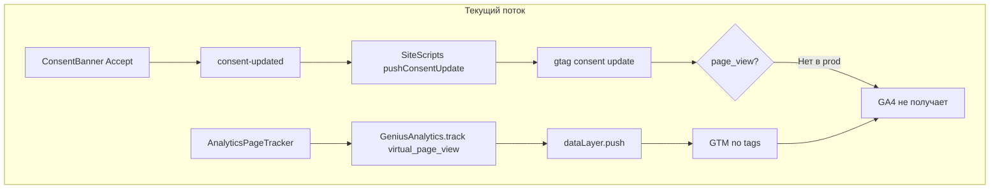

# План исправления GA4 и аналитики

## Текущая архитектура и проблема



**Причины отсутствия данных:**

1. Фикс `page_view` при consent не задеплоен (не закоммичен)
2. `virtual_page_view` идёт только в dataLayer; GTM «No tags evaluated» — события не доходят до GA4
3. GA4 ID захардкожен в `web/index.html`; плагин `ga4GtagPlugin` не используется (нет placeholder)

---

## Часть 1: Немедленные исправления

### 1.1 Фикс page_view при consent + устранение дублирования

**Файл:** `web/src/app/components/SiteScripts.tsx`

**Проблема дублирования:** `pushConsentUpdate` вызывается в двух случаях:

- при `consent-updated` (пользователь нажал «Принять») — нужно отправить `page_view`;
- при начальной загрузке, если `getConsent()?.analytics` (возвращающий посетитель) — `page_view` отправлять не нужно, т.к. `AnalyticsPageTracker` при mount отправит `virtual_page_view` для текущей страницы.

Иначе для возвращающего посетителя GA4 получит два `page_view` за одну страницу.

**Решение:** Добавить параметр `sendPageView?: boolean` в `pushConsentUpdate`:

```ts
const pushConsentUpdate = (granted: boolean, options?: { sendPageView?: boolean }) => {
  const state = { ... };
  window.gtag?.("consent", "update", state);
  window.dataLayer?.push({ event: "consent_update", ...state });
  // Only send page_view when user just clicked Accept, not on initial sync
  if (granted && options?.sendPageView) {
    window.gtag?.("event", "page_view", { page_path: ..., page_title: ... });
  }
};
```

Вызовы:

- `onConsent`: `pushConsentUpdate(e.detail.analytics, { sendPageView: e.detail.analytics })`
- `if (getConsent()?.analytics)`: `pushConsentUpdate(true)` — без `sendPageView`, page_view отправит `AnalyticsPageTracker`

### 1.2 Отправка событий в GA4 через gtag

**Проблема:** `GeniusAnalytics.track` пушит только в dataLayer; GTM не пересылает в GA4. Нужна прямая отправка через `gtag`.

**Решение:** В `GeniusAnalytics.track` после `dataLayer.push` вызывать `gtag("event", ...)` для событий, которые должны попадать в GA4. См. раздел 2.2.

---

## Часть 2: Унификация и env-based конфигурация

### 2.1 GA4 ID из переменной окружения

**Шаги:**

1. Заменить блок gtag в `index.html` на placeholder: `<!-- GA4_GTAG_SNIPPET -->`
2. В плагине: если `VITE_PUBLIC_GA4_ID` не задан, использовать fallback `G-GYDPMQ4R49`
3. В `web/.env.example` указать `VITE_PUBLIC_GA4_ID=G-GYDPMQ4R49` как пример

### 2.2 Отправка событий форм и CTA в GA4 через gtag

**События для gtag:**

- `virtual_page_view` → `gtag("event", "page_view", { page_path, page_title })`
- `form_submit_attempt`, `form_submit_success`, `form_submit_fail`, `form_submit_click` → `gtag("event", eventName, payload)`
- `cta_click_call`, `cta_click_whatsapp`, `cta_click_contact` → `gtag("event", eventName, payload)`

**Реализация в GeniusAnalytics.track:**

```ts
const ga4Events = ["virtual_page_view", "form_submit_attempt", "form_submit_success", "form_submit_fail", "form_submit_click", "cta_click_call", "cta_click_whatsapp", "cta_click_contact"];
if (ga4Events.includes(eventName)) {
  if (eventName === "virtual_page_view") {
    window.gtag?.("event", "page_view", { page_path: payload.page_path ?? "/", page_title: payload.page_title ?? document?.title ?? "" });
  } else {
    window.gtag?.("event", eventName, payload);
  }
}
```

---

## Часть 3: Документация

### 3.1 docs/ANALYTICS_ARCHITECTURE.md

- Схема потока данных
- Роли: gtag, dataLayer, GeniusAnalytics
- События и переменные окружения

### 3.2 Обновить PLAN_GOOGLE_ANALYTICS.md (troubleshooting)

---

## Чек-лист выполнения

| # | Задача | Файлы |
|---|--------|-------|
| 1 | Добавить sendPageView в pushConsentUpdate | SiteScripts.tsx |
| 2 | Добавить GA4 gtag events в GeniusAnalytics.track | SiteScripts.tsx |
| 3 | Заменить gtag в index.html на placeholder | index.html |
| 4 | Добавить fallback GA4 ID в vite plugin | vite.config.ts |
| 5 | Обновить .env.example | .env.example |
| 6 | Создать docs/ANALYTICS_ARCHITECTURE.md | docs/ |
| 7 | Обновить PLAN_GOOGLE_ANALYTICS.md | docs/ |

---

## Проверка после деплоя

1. Открыть сайт в инкогнито
2. Нажать «Принять» в баннере cookie
3. Перейти по нескольким страницам (SPA)
4. GA4 → Reports → Realtime: активный пользователь и page views
5. Клик по CTA → `cta_click_*` в Events
6. Отправка формы → `form_submit_attempt`, `form_submit_success` или `form_submit_fail`
