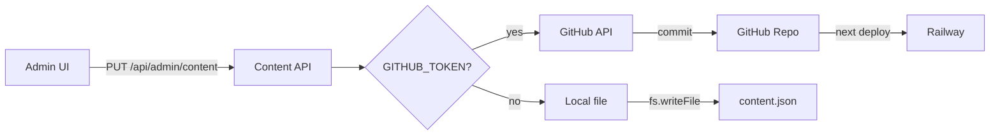

# План: сохранение content.json в GitHub

> Референсный документ. Комментарии в коде — на английском; планы — на русском.

## Цель

При сохранении контента через админку — коммитить изменения в GitHub. Правки сохраняются в репозитории и не теряются при деплое.

## Архитектура



**Принципы:**
- Единая функция `saveContent(data)` — внутри решает: GitHub или локальный файл
- Чтение остаётся из локального файла (в production файл приходит из образа = из последнего коммита)
- При сохранении в GitHub — локальный файл тоже обновляется (для консистентности и fallback GET)

---

## Этап 1: Модуль GitHub Content

### 1.1 Файл `server/lib/github-content.ts`

**Назначение:** абстракция для записи content в GitHub. Изолирует логику API, чтобы при смене хранилища (Supabase, S3) менять только этот модуль.

**Экспорт:**
```ts
export async function saveContentToGitHub(
  data: Content,
  message?: string
): Promise<{ ok: boolean; error?: string }>
```

**Логика:**
1. Проверить `GITHUB_TOKEN` и `GITHUB_REPO` (env)
2. Получить текущий `sha` файла: `GET /repos/{owner}/{repo}/contents/{path}` (path = `web/server/data/content.json`)
3. Если файл не найден (404) — `sha` не передаём (create)
4. Вызвать `PUT /repos/{owner}/{repo}/contents/{path}`:
   - `content`: base64(JSON.stringify(data, null, 2))
   - `message`: переданный message или `"admin: update content"`
   - `sha`: при обновлении (для optimistic locking)
   - `branch`: из GITHUB_BRANCH

**Ошибки:**
- 409 Conflict — кто-то изменил файл; вернуть понятную ошибку, предложить refresh
- 401/403 — неверный токен или нет прав
- Сеть — retry не нужен для MVP; логировать и возвращать ошибку

**Расширяемость:** позже можно добавить `getContentFromGitHub()` для чтения при старте, если понадобится hot-reload без деплоя.

### 1.2 Ветка и путь

- **Branch:** `GITHUB_BRANCH` (default: `main`) — в какую ветку коммитить
- **Path:** `GITHUB_CONTENT_PATH` (default: `web/server/data/content.json`)

### 1.3 Функция для получения sha

Перед PUT нужен текущий `sha`. Добавить внутреннюю функцию `getFileShaFromGitHub()`:
- `GET /repos/{owner}/{repo}/contents/{path}?ref={branch}`
- Вернуть `sha` из ответа; при 404 — вернуть `null` (создание нового файла)

---

## Этап 2: Рефакторинг content API

### 2.1 Единая функция сохранения

**Файл:** `server/api/content.ts`

Добавить:
```ts
async function saveContent(
  data: Content,
  message?: string
): Promise<{ ok: boolean; error?: string }> {
  if (process.env.GITHUB_TOKEN && process.env.GITHUB_REPO) {
    const result = await saveContentToGitHub(data, message);
    if (result.ok && process.env.NODE_ENV !== "production") {
      writeContentLocal(data); // dev only; production fs may be read-only
    }
    return result;
  }
  writeContentLocal(data);
  return { ok: true };
}
```

`writeContentLocal` — переименовать текущую `writeContent` или вынести в отдельную функцию.

### 2.2 Обновить putContent, putContentServices, putContentServicePage

- Убрать прямой вызов `writeContent`
- Вызывать `await saveContent(data)`
- При `ok: false` — `res.status(500).json({ error: result.error })`
- Убрать backup в `.bak` при сохранении в GitHub (Git — уже история)

### 2.3 Обработка 409 Conflict

Если GitHub вернул 409 — файл изменился. Варианты:
- **A:** Вернуть 409 клиенту, показать toast «Кто-то изменил контент. Обновите страницу и повторите»
- **B:** Автоматически перечитать из GitHub, merge (сложнее)

Для MVP — вариант A.

---

## Этап 3: Путь к файлу в репозитории

**Текущая структура репо:** корень = `genius site/`, внутри `web/server/data/content.json`

**Путь для GitHub API:** `web/server/data/content.json`

**Env:** `GITHUB_REPO` = `rilya888/GeniusLab` (owner/repo)
**Опционально:** `GITHUB_CONTENT_PATH` = `web/server/data/content.json` (если путь изменится)

---

## Этап 4: GET /api/content — источник данных

**Текущее поведение:** читает из локального файла (build-time копия из репо).

**При сохранении в GitHub:** при следующем деплое Railway подтянет новый коммит — файл в образе обновится. **До завершения деплоя** GET вернёт старые данные (из текущего образа). Это ожидаемо — пользователь увидит изменения после пересборки (обычно 1–3 мин).

**Опционально (позже):** если нужны изменения без деплоя — GET может читать из GitHub API. Потребует кэширование и учёт rate limits. Не в MVP.

---

## Этап 5: Ошибки и логирование

- Не логировать `GITHUB_TOKEN` в ошибках
- Логировать: `GitHub save failed: 401` (без деталей токена)
- При 409 — в ответе API: `{ error: "Content was modified. Please refresh and try again." }`

---

## Порядок реализации

| # | Задача |
|---|--------|
| 1 | Создать `server/lib/github-content.ts` (использовать `import type { Content }` — type-only не создаёт circular load) |
| 2 | Добавить `saveContent()` в content.ts с ветвлением GitHub / local |
| 3 | Рефакторинг putContent, putContentServices, putContentServicePage — использовать saveContent с message |
| 4 | Обработка 409, улучшение сообщений об ошибках |
| 5 | Обновить PLAN_ADMIN_PANEL.md — добавить раздел про GitHub storage |

---

## Файлы

| Файл | Действие |
|------|----------|
| `web/server/lib/github-content.ts` | Создать |
| `web/server/api/content.ts` | Рефакторинг: saveContent, вызов GitHub |
| `docs/PLAN_ADMIN_PANEL.md` | Добавить раздел GitHub storage |

---

## Env vars (уже добавлены пользователем)

- `GITHUB_TOKEN` — Personal Access Token с scope `repo`
- `GITHUB_REPO` — `rilya888/GeniusLab`

Опционально:
- `GITHUB_BRANCH` — ветка (default: `main`)
- `GITHUB_CONTENT_PATH` — путь к файлу (default: `web/server/data/content.json`)

---

## Дополнительные пункты

### Конфликты при частичных обновлениях

`putContentServices` и `putContentServicePage` делают merge: читают текущий content (локально), вносят изменения, сохраняют. Для GitHub нужен актуальный `sha` — его получаем через GET перед PUT. Если между GET и PUT кто-то успел закоммитить, GitHub вернёт 409. Пользователь обновляет страницу и повторяет сохранение.

### Rate limits GitHub API

Для авторизованных запросов — 5000/час. Типичное использование админки — единицы сохранений в день. Лимиты не должны быть проблемой.

### Commit message

Передавать в `saveContentToGitHub` опциональный `message`:
- `putContent` → `"admin: update full content"`
- `putContentServices` → `"admin: update services"`
- `putContentServicePage` → `"admin: update servicePage {key}"`

Упрощает отладку и откат в git history.
