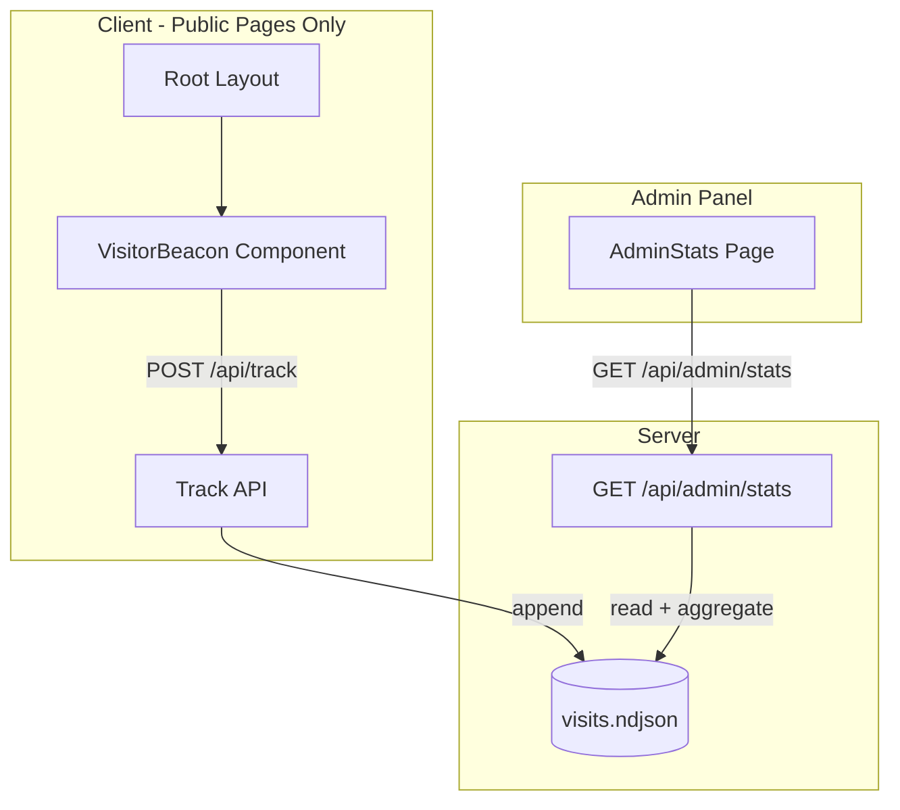

# План: Простой счётчик посетителей (без согласия)

## Цель

Минимальный счётчик для понимания ранжирования сайта: уникальные посетители, источник (referrer), устройство. Без cookies, анонимный IP (хеш). Позже — подключение GA и расширение аналитики.

---

## Архитектура



**Принципы для будущей интеграции:**

- Отдельный модуль `visits` — легко заменить хранилище (SQLite, Postgres) или добавить экспорт в GA
- Типы `Visit`, `StatsSummary` — общие контракты, GA-данные можно объединять по тем же полям
- Beacon не зависит от consent — работает всегда; GA/GTM остаётся за consent

---

## 1. Хранение данных

**Путь:** задаётся через `VISITS_FILE` (default: `path.join(__dirname, '../data/visits.ndjson')`). В production с Railway Volume — `VISITS_FILE=/app/data/visits.ndjson`.

Формат: одна строка = один JSON-объект (append-only, безопасно при конкурентных записях).

**Структура записи:**

```json
{
  "id": "uuid-v4",
  "visitorHash": "sha256(ip+ua)[:16]",
  "ts": "2026-02-25T12:00:00.000Z",
  "path": "/servizi/iphone",
  "referrer": "https://google.com/",
  "device": "mobile"
}
```

- `visitorHash` — хеш `IP + User-Agent` (первые 16 символов), без хранения сырого IP
- `device` — `"mobile" | "tablet" | "desktop"` по User-Agent
- `referrer` — только origin (без path/query); пустой → сохранять `"(direct)"` для отображения в админке

---

## 2. Backend: Track API

**Файл:** `web/server/api/visits.ts` (новый)

**Endpoint:** `POST /api/track`

- **Публичный**, без auth
- **Body:** `{ path: string, referrer: string }` — от клиента
- **Сервер добавляет:** `ts`, `visitorHash`, `device`, `id`
- **IP:** `req.ip` или `req.headers['x-forwarded-for']` (для Railway)
- **Device:** парсинг `User-Agent` (простая логика, без зависимостей)
- **Исключения:** не логировать запросы с path `/admin` (на случай прямого захода)
- **Referrer:** сохранять только origin (например `https://google.com`), без path и query — для приватности
- **Rate limiting:** 60 запросов/мин на IP — простая in-memory реализация (Map<IP, {count, resetAt}>) без новых зависимостей

---

## 3. Backend: Stats API

**Endpoint:** `GET /api/admin/stats` — защищён `requireAuth`

**Query:** `?days=7` (по умолчанию 30)

**Ответ:**

```ts
{
  totalVisits: number,
  uniqueVisitors: number,
  byDevice: { mobile: number, tablet: number, desktop: number },
  byReferrer: { [referrer: string]: number },  // top 20
  byPath: { [path: string]: number }           // top 20
}
```

---

## 4. Client: Visitor Beacon

**Файл:** `web/src/app/components/VisitorBeacon.tsx`

- Вызывается только в `Root.tsx` — публичные страницы
- `useEffect` с зависимостью от `useLocation().pathname`
- `navigator.sendBeacon(url, new Blob([JSON.stringify(body)], { type: 'application/json' }))`
- Body: `{ path, referrer }`
- Не отправлять, если `pathname.startsWith('/admin')`

---

## 5. Admin: страница статистики

**Файл:** `web/src/app/admin/pages/AdminStats.tsx`

- Карточки (Total visits, Unique visitors), таблицы (Referrers, Devices, Top pages)
- Селектор периода: 7 / 30 дней
- UX: loading, error, empty state

---

## 6. Политика конфиденциальности

Добавить в `pages.policies.privacyBody` (i18n it.ts, en.ts) секцию о базовой аналитике.

---

## 7. Persistence (Railway)

`VISITS_FILE` env var. Для production с Railway Volume: `VISITS_FILE=/app/data/visits.ndjson`.

При деплое на Railway: примонтировать Volume в `/app/data` и задать переменную окружения `VISITS_FILE=/app/data/visits.ndjson`, чтобы статистика сохранялась между redeploy.

---

## 8. .gitignore

Добавить `web/server/data/visits.ndjson`.

---

## Порядок реализации

1. `server/api/visits.ts` — postTrack, getStats, append/read NDJSON, device parser, rate limit
2. Регистрация роутов в `server/api/index.ts`
3. `VisitorBeacon.tsx` + подключение в `Root.tsx`
4. `AdminStats.tsx` + роут + пункт меню в AdminLayout
5. Обновление privacy policy (i18n)
6. .gitignore
